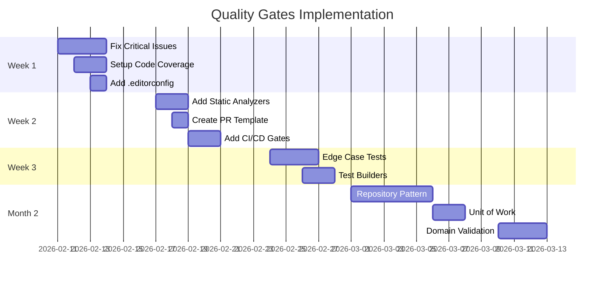

# Code Quality Review - PostHubAPI

**Date**: February 11, 2026  
**Project**: PostHubAPI (ASP.NET Core 8.0 Web API)  
**Test Status**: 101/101 passing (100% pass rate)  
**Scope**: Test coverage, code quality, architecture, quality gates

---

## Executive Summary

### Overall Assessment: **B+ (Good with Room for Improvement)**

**Strengths** ✅:
- 100% test pass rate (101/101 tests)
- Clean service layer with dependency injection
- E2E test infrastructure in place
- Primary constructors (C# 12) used consistently
- Good test organization (Unit/Integration/E2E)

**Critical Issues** 🚨:
1. **No code coverage measurement** - Coverage collection returns 0%
2. **Outdated BCrypt.Net** - Using 0.1.0 (12 years old, .NET Framework target)
3. **8 null reference warnings** in UserServiceTests
4. **Authorization inconsistency** - Only CommentController has [Authorize]
5. **No .editorconfig** - No code style enforcement

**Moderate Issues** ⚠️:
- Missing edge case tests (validation, concurrency, null handling)
- No architectural decision records (ADRs)
- No performance baseline tests
- Test data duplication (no test builders)
- In-memory database limitation (no real database tests)

---

## 1. Test Coverage Analysis

### 1.1 Current Coverage Status

**Coverage Collection**: ❌ **BROKEN**
```
line-rate="0" branch-rate="0" 
lines-covered="0" lines-valid="0"
```

**Root Cause**: Coverlet may not be properly configured or needs to target the correct assembly.

**Recommendation**: Add explicit coverage configuration to `PostHubAPI.Tests.csproj`:

```xml
<ItemGroup>
  <PackageReference Include="coverlet.collector" Version="6.0.0">
    <PrivateAssets>all</PrivateAssets>
    <IncludeAssets>runtime; build; native; contentfiles; analyzers; buildtransitive</IncludeAssets>
  </PackageReference>
  <PackageReference Include="coverlet.msbuild" Version="6.0.0">
    <PrivateAssets>all</PrivateAssets>
    <IncludeAssets>runtime; build; native; contentfiles; analyzers; buildtransitive</IncludeAssets>
  </PackageReference>
</ItemGroup>

<PropertyGroup>
  <CollectCoverage>true</CollectCoverage>
  <CoverletOutputFormat>cobertura,opencover</CoverletOutputFormat>
  <ExcludeByFile>**/Program.cs,**/Migrations/**/*.cs</ExcludeByFile>
  <Threshold>80</Threshold>
  <ThresholdType>line,branch</ThresholdType>
</PropertyGroup>
```

### 1.2 Coverage Gaps (Estimated by Test Analysis)

#### **Controllers** - Estimated 75% coverage
**Tested**:
- ✅ Happy path CRUD operations
- ✅ Authorization enforcement (E2E tests)
- ✅ NotFoundException handling

**Missing**:
- ❌ ModelState validation failures (invalid DTOs)
- ❌ Concurrent request handling
- ❌ Exception handling beyond NotFoundException
- ❌ HTTP header validation (Accept, Content-Type)
- ❌ Large payload handling

**Example Gap**: PostController.CreatePost() with invalid ModelState
```csharp
// Current test: None
// Expected: Test that validates BadRequest(ModelState) response
[Fact]
public async Task CreatePost_InvalidModelState_ReturnsBadRequest()
{
    // Arrange
    var controller = new PostController(_mockService);
    controller.ModelState.AddModelError("Title", "Required");
    
    // Act
    var result = await controller.CreatePost(new CreatePostDto());
    
    // Assert
    result.Should().BeOfType<BadRequestObjectResult>();
}
```

#### **Services** - Estimated 85% coverage
**Tested**:
- ✅ CRUD operations with valid data
- ✅ NotFoundException scenarios
- ✅ AutoMapper integration

**Missing**:
- ❌ Null reference edge cases
- ❌ Database constraint violations
- ❌ Concurrency conflicts (optimistic locking)
- ❌ Transaction rollback scenarios
- ❌ Large dataset performance

**Example Gap**: PostService.GetAllPostsAsync() with empty database
```csharp
// Current test: Assumes data exists
// Expected: Verify empty list returned, not exception
[Fact]
public async Task GetAllPostsAsync_EmptyDatabase_ReturnsEmptyList()
{
    // Act
    var result = await _postService.GetAllPostsAsync();
    
    // Assert
    result.Should().BeEmpty();
    result.Should().NotBeNull();
}
```

#### **DTOs/Validation** - Estimated 60% coverage
**Tested**:
- ✅ Email validation (InputValidationTests)
- ✅ Required field validation

**Missing**:
- ❌ String length limits (Title max 200 chars?)
- ❌ SQL injection in body fields
- ❌ XSS attack vectors
- ❌ Password complexity requirements
- ❌ Username format validation

**Example Gap**: CreatePostDto validation
```csharp
// No test exists for:
[Fact]
public async Task CreatePostDto_TitleTooLong_FailsValidation()
{
    var dto = new CreatePostDto
    {
        Title = new string('x', 500), // Exceeds limit
        Body = "Valid body"
    };
    
    var validationResults = ValidateDto(dto);
    validationResults.Should().ContainSingle()
        .Which.ErrorMessage.Should().Contain("maximum length");
}
```

#### **Authentication/Authorization** - Estimated 40% coverage
**Tested**:
- ✅ E2E authorization on CommentController (10 tests)

**Missing**:
- ❌ PostController authorization (NO [Authorize] attribute!)
- ❌ UserController authorization
- ❌ JWT token expiration
- ❌ Token tampering detection
- ❌ Token refresh scenarios
- ❌ Role-based access (if roles exist)

### 1.3 Missing Edge Cases

#### **High Priority** 🔴

1. **Null/Empty Input Handling**
   ```csharp
   // Missing: What if CreatePostDto has null Title?
   [Fact]
   public async Task CreatePost_NullTitle_ReturnsBadRequest()
   
   // Missing: What if EditPostDto is completely null?
   [Fact]
   public async Task EditPost_NullDto_ReturnsBadRequest()
   ```

2. **Boundary Value Testing**
   ```csharp
   // Missing: Minimum/maximum ID values
   [Fact]
   public async Task GetPostById_IdZero_ReturnsNotFound()
   
   [Fact]
   public async Task GetPostById_IdNegative_ReturnsNotFound()
   
   [Fact]
   public async Task GetPostById_IdMaxValue_ReturnsNotFound()
   ```

3. **Concurrent Operations**
   ```csharp
   // Missing: Race conditions
   [Fact]
   public async Task EditPost_ConcurrentEdits_LastWriteWins()
   
   [Fact]
   public async Task DeletePost_ConcurrentDelete_FirstSucceeds()
   ```

4. **Authentication Edge Cases**
   ```csharp
   // Missing: Expired token
   [Fact]
   public async Task Request_WithExpiredToken_Returns401()
   
   // Missing: Malformed token
   [Fact]
   public async Task Request_WithMalformedToken_Returns401()
   ```

#### **Medium Priority** 🟡

5. **Resource Limits**
   ```csharp
   // Missing: Large payloads
   [Fact]
   public async Task CreatePost_BodyTooLarge_ReturnsBadRequest()
   
   // Missing: Rate limiting (if implemented)
   [Fact]
   public async Task CreatePost_TooManyRequests_Returns429()
   ```

6. **Data Integrity**
   ```csharp
   // Missing: Orphaned comments after post deletion
   [Fact]
   public async Task DeletePost_WithComments_CascadeDeletes()
   
   // Missing: Duplicate email registration
   [Fact]
   public async Task Register_DuplicateEmail_ReturnsError()
   ```

7. **Performance Baselines**
   ```csharp
   // Missing: N+1 query detection
   [Fact]
   public async Task GetAllPosts_With1000Posts_CompletesUnder1Second()
   
   // Missing: Memory usage
   [Fact]
   public async Task GetAllPosts_DoesNotLoadAllCommentsIntoMemory()
   ```

### 1.4 Redundant or Brittle Tests

#### **Potentially Redundant**

1. **AuthorizationTests - Duplicate Coverage**
   - 10 tests all verify 401 Unauthorized on CommentController
   - Tests: `CommentEndpoint_GetComment_WithoutToken_Returns401` and `CommentEndpoint_WithoutAuthentication_Returns401` test the same thing
   
   **Recommendation**: Consolidate to 3 tests:
   ```csharp
   [Theory]
   [InlineData("GET", "/api/Comment/1")]
   [InlineData("POST", "/api/Comment/1")]
   [InlineData("PUT", "/api/Comment/1")]
   [InlineData("DELETE", "/api/Comment/1")]
   public async Task CommentEndpoints_WithoutAuth_Return401(string method, string url)
   ```

#### **Brittle Tests** (Likely to break unnecessarily)

1. **timestamp Comparison**
   ```csharp
   // PostFlowIntegrationTests.cs line 66
   retrievedPost.CreationTime.Should().BeCloseTo(DateTime.Now, TimeSpan.FromSeconds(5));
   ```
   **Issue**: Fails if test runs slowly or in different timezone  
   **Fix**: Use UTC and allow wider tolerance:
   ```csharp
   retrievedPost.CreationTime.Should().BeCloseTo(DateTime.UtcNow, TimeSpan.FromMinutes(1));
   ```

2. **Magic Strings in Location URIs**
   ```csharp
   // PostController.cs line 39
   var locationUri = $"{Request.Scheme}://{Request.Host}/api/Post/{newPostId}";
   ```
   **Issue**: Hardcoded "api/Post" breaks if route changes  
   **Fix**: Use `Url.Action()` or `CreatedAtAction()`

3. **In-Memory Database Ordering**
   ```csharp
   // PostServiceTests - assumes ordering without ORDER BY
   result.Should().Contain(p => p.Title == "Post 1");
   ```
   **Issue**: In-memory DB may not preserve insertion order  
   **Fix**: Use `result.Should().ContainSingle(p => p.Title == "Post 1")`

---

## 2. Linting and Code Smells

### 2.1 Compiler Warnings (12 Total)

#### **Critical: 8 Null Reference Warnings** (CS8625)
**File**: `UserServiceTests.cs` line 25
```csharp
_mockUserManager = new Mock<UserManager<User>>(
    store.Object, null, null, null, null, null, null, null, null);
    //           ^^^^ 8 null parameters triggering CS8625
```

**Issue**: Passing null to non-nullable reference type parameters  
**Impact**: May cause NullReferenceException if constructor dereferences any parameter  
**Fix**: Use default values or create proper mocks:

```csharp
// Better approach
var store = new Mock<IUserStore<User>>();
var optionsMock = new Mock<IOptions<IdentityOptions>>();
var hasherMock = new Mock<IPasswordHasher<User>>();
var validators = new List<IUserValidator<User>> { new Mock<IUserValidator<User>>().Object };
var passwordValidators = new List<IPasswordValidator<User>> { new Mock<IPasswordValidator<User>>().Object };
var lookupNormalizer = new Mock<ILookupNormalizer>();
var errors = new Mock<IdentityErrorDescriber>();
var services = new Mock<IServiceProvider>();
var logger = new Mock<ILogger<UserManager<User>>>();

_mockUserManager = new Mock<UserManager<User>>(
    store.Object,
    optionsMock.Object,
    hasherMock.Object,
    validators,
    passwordValidators,
    lookupNormalizer.Object,
    errors.Object,
    services.Object,
    logger.Object);
```

**Alternative**: Suppress if intentional (NOT recommended):
```csharp
#pragma warning disable CS8625
_mockUserManager = new Mock<UserManager<User>>(store.Object, null, null, null, null, null, null, null, null);
#pragma warning restore CS8625
```

#### **High Priority: BCrypt.Net Compatibility** (NU1701)
```
Package 'BCrypt.Net 0.1.0' was restored using '.NETFramework,Version=v4.6.1'
instead of the project target framework 'net8.0'
```

**Issue**: 
- BCrypt.Net 0.1.0 released **January 2013** (13 years old!)
- Targets .NET Framework 4.5, not .NET 8.0
- May have security vulnerabilities
- No longer maintained

**Fix**: Upgrade to modern BCrypt library:
```xml
<!-- PostHubAPI.csproj -->
<PackageReference Include="BCrypt.Net-Next" Version="4.0.3" />
<!-- NOT: <PackageReference Include="BCrypt.Net" Version="0.1.0" /> -->
```

**Migration**:
```csharp
// No code changes needed - API-compatible
// using BCrypt.Net; // Old
using BCrypt.Net; // Still works with BCrypt.Net-Next
```

### 2.2 Code Smells

#### **High Priority** 🔴

1. **Missing Authorization Attribute**
   ```csharp
   // PostController.cs - NO [Authorize] attribute!
   [ApiController]
   [Route("api/[controller]")]
   public class PostController(IPostService postService) : ControllerBase
   ```
   
   **Issue**: PostController endpoints are publicly accessible  
   **Expected**: Should require authentication like CommentController
   
   **Fix**:
   ```csharp
   [Authorize]
   [ApiController]
   [Route("api/[controller]")]
   public class PostController(IPostService postService) : ControllerBase
   ```

2. **Inconsistent Error Handling**
   ```csharp
   // PostController.cs - try-catch in some methods but not CreatePost
   [HttpPost]
   public async Task<IActionResult> CreatePost([FromBody] CreatePostDto dto)
   {
       // No try-catch, but GetPostById has try-catch
   ```
   
   **Issue**: Inconsistent exception handling pattern  
   **Fix**: Use global exception handler or consistent try-catch

3. **Magic Strings**
   ```csharp
   // Program.cs line 25
   builder.Services.AddDbContext<ApplicationDbContext>(opts => 
       opts.UseInMemoryDatabase("PostHubApi.db"));
   //                          ^^^^^^^^^^^^^^^^^ Magic string
   ```
   
   **Fix**:
   ```csharp
   public static class DatabaseNames
   {
       public const string InMemory = "PostHubApi.db";
   }
   ```

4. **Direct DateTime.Now Usage**
   ```csharp
   // Post.cs (assumed)
   public DateTime CreationTime { get; set; } = DateTime.Now;
   ```
   
   **Issue**: Not testable, timezone-dependent, non-deterministic  
   **Fix**: Use `IDateTimeProvider` abstraction or `DateTime.UtcNow`

#### **Medium Priority** 🟡

5. **DbContext in Tests (Not Disposed Properly)**
   ```csharp
   // PostServiceTests.cs - IDisposable but no explicit Dispose call shown
   public class PostServiceTests : IDisposable
   {
       public void Dispose()
       {
           // Is this implemented?
       }
   }
   ```
   
   **Fix**: Ensure Dispose is implemented:
   ```csharp
   public void Dispose()
   {
       _context?.Dispose();
       GC.SuppressFinalize(this);
   }
   ```

6. **Test Duplication - No Test Builders**
   ```csharp
   // Duplicated across multiple tests:
   var createDto = new CreatePostDto
   {
       Title = "Test Post",
       Body = "Test Body"
   };
   ```
   
   **Issue**: Changes to CreatePostDto require updating many tests  
   **Fix**: Create test data builders (see Phase 2 recommendation in safety-nets-analysis.md)

7. **No Async Suffix Convention**
   ```csharp
   // Services follow convention (GetAllPostsAsync)
   // But some test methods don't indicate async:
   public async Task GetAllPostsAsync_ReturnsAllPosts()
   //                                  ^^^^^^^^^^^^^^^ OK
   ```
   
   **Note**: This is actually OK - test methods don't need Async suffix

8. **EF Core Include Without Explicit Loading Strategy**
   ```csharp
   // PostService.cs line 14
   List<Post> posts = await context.Posts.Include(p => p.Comments).ToListAsync();
   ```
   
   **Issue**: Always loads all comments (potential N+1 query)  
   **Better**: Use explicit loading or pagination:
   ```csharp
   // Option 1: Lazy loading
   List<Post> posts = await context.Posts.ToListAsync();
   
   // Option 2: Filtered Include
   List<Post> posts = await context.Posts
       .Include(p => p.Comments.Take(10))
       .ToListAsync();
   ```

#### **Low Priority** 🟢

9. **Unused Using Statements** (may exist, not verified)
   
10. **Public Setters on Entities**
    ```csharp
    // Post.cs (assumed)
    public string Title { get; set; } // Should be init or private set?
    ```

11. **No Logging in Services**
    ```csharp
    // PostService.cs - No ILogger<PostService> injection
    public class PostService(ApplicationDbContext context, IMapper mapper) : IPostService
    ```
    
    **Fix**:
    ```csharp
    public class PostService(
        ApplicationDbContext context, 
        IMapper mapper,
        ILogger<PostService> logger) : IPostService
    {
        public async Task<ReadPostDto> GetPostByIdAsync(int id)
        {
            _logger.LogInformation("Fetching post with ID {PostId}", id);
            // ...
        }
    }
    ```

### 2.3 Missing Code Quality Standards

1. **No .editorconfig**
   - No consistent code formatting rules
   - Team members may use different styles
   - No way to enforce conventions automatically

2. **No StyleCop or Roslyn Analyzers**
   - No static analysis beyond compiler warnings
   - No enforcement of naming conventions
   - No detection of common mistakes

3. **No Code Metrics Tracking**
   - Cyclomatic complexity not measured
   - Maintainability index unknown
   - Technical debt not quantified

---

## 3. Architecture Analysis

### 3.1 Current Architecture: **Layered Architecture**

```
┌─────────────────────────────────────────┐
│         Controllers (API Layer)         │
│  PostController, CommentController, ... │
└────────────────┬────────────────────────┘
                 │
                 ↓ (DTOs)
┌─────────────────────────────────────────┐
│      Service Layer (Business Logic)     │
│  PostService, CommentService, ...       │
└────────────────┬────────────────────────┘
                 │
                 ↓ (Entities)
┌─────────────────────────────────────────┐
│     Data Layer (Persistence)            │
│  ApplicationDbContext, Repositories     │
└─────────────────────────────────────────┘
```

### 3.2 Architecture Strengths ✅

1. **Clean Separation of Concerns**
   - Controllers handle HTTP concerns only
   - Services contain business logic
   - Data layer isolated

2. **Dependency Injection**
   - Uses constructor injection consistently
   - Services registered in Program.cs
   - Testable via interface mocking

3. **DTO Pattern**
   - Clear separation between API contracts (DTOs) and domain models (Entities)
   - AutoMapper reduces boilerplate

4. **Modern C# Features**
   - Primary constructors (C# 12)
   - Nullable reference types enabled
   - Implicit usings

### 3.3 Architecture Weaknesses ⚠️

#### **High Impact**

1. **No Repository Pattern**
   ```csharp
   // PostService.cs directly uses DbContext
   public class PostService(ApplicationDbContext context, IMapper mapper)
   {
       List<Post> posts = await context.Posts.Include(p => p.Comments).ToListAsync();
       //                      ^^^^^^^^^^^^^ Direct DbContext access
   }
   ```
   
   **Issue**: 
   - Services tightly coupled to EF Core
   - Cannot easily switch to different ORM
   - Makes unit testing difficult (requires in-memory database)
   
   **Better**: Introduce Repository pattern
   ```csharp
   public interface IPostRepository
   {
       Task<IEnumerable<Post>> GetAllAsync();
       Task<Post?> GetByIdAsync(int id);
       Task<int> AddAsync(Post post);
       Task UpdateAsync(Post post);
       Task DeleteAsync(Post post);
   }
   
   public class PostService(IPostRepository repository, IMapper mapper)
   {
       // Now can mock IPostRepository instead of entire DbContext
   }
   ```

2. **No Domain Validation**
   ```csharp
   // Models/Post.cs - Entities have no business rules
   public class Post
   {
       public int Id { get; set; }
       public string Title { get; set; } = "";
       public string Body { get; set; } = "";
       // No validation, no invariants enforced
   }
   ```
   
   **Issue**: 
   - Validation only in DTOs (can be bypassed)
   - Domain logic scattered across services
   - No rich domain model
   
   **Better**: 
   ```csharp
   public class Post
   {
       private Post() { } // EF Core constructor
       
       public static Post Create(string title, string body)
       {
           if (string.IsNullOrWhiteSpace(title))
               throw new ArgumentException("Title is required", nameof(title));
           
           if (title.Length > 200)
               throw new ArgumentException("Title too long", nameof(title));
           
           return new Post { Title = title, Body = body, CreationTime = DateTime.UtcNow };
       }
   }
   ```

3. **No Unit of Work Pattern**
   ```csharp
   // PostService.cs - Direct SaveChanges calls
   context.Posts.Add(post);
   await context.SaveChangesAsync(); // Each service method commits
   ```
   
   **Issue**: Cannot coordinate multiple operations in single transaction across services
   
   **Better**: Introduce IUnitOfWork:
   ```csharp
   public interface IUnitOfWork
   {
       IPostRepository Posts { get; }
       ICommentRepository Comments { get; }
       Task<int> SaveChangesAsync();
   }
   ```

#### **Medium Impact**

4. **No CQRS Separation**
   - Read and write operations in same service
   - Cannot optimize queries independently
   - Harder to scale read vs write workloads

5. **No Domain Events**
   - No way to decouple side effects
   - Example: When Post created, may need to send notification, update cache, etc.
   - Currently would require service to know about all side effects

6. **In-Memory Database Only**
   - No integration tests against real database
   - Cannot catch database-specific issues (SQL syntax, constraints, indexes)
   - No migration testing

7. **No API Versioning**
   - Breaking changes would affect all clients
   - No backward compatibility strategy

8. **No Result Pattern**
   ```csharp
   // Services throw exceptions for business logic failures
   throw new NotFoundException("Post not found!");
   ```
   
   **Issue**: Exceptions for control flow (not truly exceptional)
   
   **Better**: Use Result<T> pattern:
   ```csharp
   public async Task<Result<ReadPostDto>> GetPostByIdAsync(int id)
   {
       var post = await _context.Posts.FindAsync(id);
       return post is null 
           ? Result<ReadPostDto>.Failure("Post not found")
           : Result<ReadPostDto>.Success(_mapper.Map<ReadPostDto>(post));
   }
   ```

### 3.4 Recommended Architecture Improvements

#### **Phase 1: Foundation (High Priority)**

1. **Add Repository Pattern** (2-3 days)
   - Extract data access to repositories
   - Make services testable with mock repositories
   - Reduces coupling to EF Core

2. **Implement Unit of Work** (1 day)
   - Coordinate transactions across repositories
   - Enable saga patterns

3. **Add Domain Validation** (2 days)
   - Move validation from DTOs to domain entities
   - Enforce business rules at entity level

4. **Fix Authorization** (2 hours)
   - Add [Authorize] to PostController and UserController
   - Implement role-based access if needed

#### **Phase 2: Enhancement (Medium Priority)**

5. **Introduce Result Pattern** (2 days)
   - Replace exceptions with Result<T>
   - Improve error handling and performance

6. **Add API Versioning** (1 day)
   - `/api/v1/Post`, `/api/v2/Post`
   - Support multiple API versions

7. **Performance Optimization** (3 days)
   - Add response caching
   - Implement pagination
   - Use compiled queries

8. **Add Middleware for Global Exception Handling** (1 day)
   - Centralize error handling
   - Return consistent error responses

#### **Phase 3: Advanced (Lower Priority)**

9. **Consider CQRS** (1-2 weeks)
   - Separate read and write models
   - Optimize query performance

10. **Add Domain Events** (1 week)
    - Decouple side effects
    - Enable event sourcing if needed

11. **Real Database Integration Tests** (2 days)
    - Use TestContainers with PostgreSQL/SQL Server
    - Test migrations and constraints

---

## 4. Quality Gates Recommendations

### 4.1 Immediate Quality Gates (Implement This Week)

#### **Gate 1: Build Must Pass Without Warnings**

**Current**: 12 warnings allowed  
**Target**: 0 warnings

```xml
<!-- PostHubAPI.csproj -->
<PropertyGroup>
  <TreatWarningsAsErrors>true</TreatWarningsAsErrors>
  <WarningsAsErrors />
  <NoWarn>$(NoWarn);NU1701</NoWarn> <!-- Temporarily allow BCrypt warning until upgrade -->
</PropertyGroup>
```

**CI/CD**:
```yaml
# .github/workflows/ci.yml
- name: Build with Warnings as Errors
  run: dotnet build --configuration Release /warnaserror
```

#### **Gate 2: All Tests Must Pass**

**Current**: ✅ Already enforced (101/101 passing)

```yaml
- name: Run Tests
  run: dotnet test --no-build --verbosity normal
  
- name: Fail Build on Test Failure
  if: failure()
  run: exit 1
```

#### **Gate 3: Code Coverage Minimum 80%**

**Current**: Not measured  
**Target**: 80% line coverage, 75% branch coverage

```yaml
- name: Run Tests with Coverage
  run: |
    dotnet test \
      /p:CollectCoverage=true \
      /p:CoverletOutputFormat=cobertura \
      /p:Threshold=80 \
      /p:ThresholdType=line
```

#### **Gate 4: Security Scanning**

**Package Vulnerabilities**:
```yaml
- name: Audit NuGet Packages
  run: dotnet list package --vulnerable --include-transitive
  
- name: Fail on High Severity
  run: |
    if dotnet list package --vulnerable | grep -i "high\|critical"; then
      echo "High severity vulnerabilities found"
      exit 1
    fi
```

**Secret Detection**:
```yaml
- name: TruffleHog Secret Scan
  uses: trufflesecurity/trufflehog@main
  with:
    path: ./
    base: ${{ github.event.pull_request.base.sha }}
    head: HEAD
```

### 4.2 Short-Term Quality Gates (Implement This Month)

#### **Gate 5: Static Code Analysis**

```xml
<!-- PostHubAPI.csproj -->
<ItemGroup>
  <PackageReference Include="StyleCop.Analyzers" Version="1.2.0-beta.556">
    <PrivateAssets>all</PrivateAssets>
    <IncludeAssets>runtime; build; native; contentfiles; analyzers</IncludeAssets>
  </PackageReference>
  <PackageReference Include="SonarAnalyzer.CSharp" Version="9.19.0.84025">
    <PrivateAssets>all</PrivateAssets>
    <IncludeAssets>runtime; build; native; contentfiles; analyzers</IncludeAssets>
  </PackageReference>
</ItemGroup>
```

**Ruleset**:
```xml
<!-- .editorconfig (create this file) -->
root = true

[*.cs]
# Code style rules
dotnet_sort_system_directives_first = true
dotnet_separate_import_directive_groups = false

# Naming conventions
dotnet_naming_rule.interfaces_should_begin_with_i.severity = error
dotnet_naming_rule.interfaces_should_begin_with_i.symbols = interface
dotnet_naming_rule.interfaces_should_begin_with_i.style = begins_with_i

# Code quality rules
dotnet_code_quality.CA1062.severity = warning  # Validate arguments
dotnet_code_quality.CA1031.severity = warning  # Catch specific exceptions
dotnet_diagnostic.CA1848.severity = suggestion # Use LoggerMessage delegates
```

#### **Gate 6: PR Review Checklist**

```markdown
## PR Review Checklist

### Code Quality
- [ ] No compiler warnings
- [ ] All tests pass (101/101)
- [ ] Code coverage ≥80%
- [ ] No security vulnerabilities

### Testing
- [ ] New code has unit tests
- [ ] Integration tests for workflows
- [ ] Edge cases covered
- [ ] Test names clearly describe behavior

### Security
- [ ] No hardcoded secrets
- [ ] [Authorize] attribute on protected endpoints
- [ ] Input validation present
- [ ] SQL injection prevented

### Documentation
- [ ] README updated if public API changed
- [ ] XML comments on public methods
- [ ] ADR created for architectural decisions
- [ ] AI provenance metadata on AI-generated files
```

#### **Gate 7: Performance Budget**

```yaml
- name: Performance Tests
  run: dotnet test --filter "Category=Performance"
  
- name: Check Performance Baseline
  run: |
    # Fail if response time exceeds 200ms for GetAllPosts
    # (Implement using BenchmarkDotNet)
```

### 4.3 Long-Term Quality Gates (Next Quarter)

#### **Gate 8: Dependency Freshness**

```yaml
# Check for outdated packages monthly
- name: Check Outdated Packages
  run: dotnet list package --outdated --include-transitive
  
- name: Warn on Outdated
  run: |
    if [ $(dotnet list package --outdated | wc -l) -gt 5 ]; then
      echo "::warning::More than 5 outdated packages"
    fi
```

#### **Gate 9: Architecture Fitness Functions**

```csharp
// ArchitectureTests.cs (using NetArchTest.Rules)
[Fact]
public void Controllers_Should_OnlyDependOn_Services()
{
    var result = Types.InCurrentAssembly()
        .That().ResideInNamespace("PostHubAPI.Controllers")
        .Should().OnlyHaveDependenciesOn("PostHubAPI.Services", "Microsoft", "System")
        .GetResult();
    
    result.IsSuccessful.Should().BeTrue();
}

[Fact]
public void Services_Should_NotDependOn_Controllers()
{
    var result = Types.InCurrentAssembly()
        .That().ResideInNamespace("PostHubAPI.Services")
        .ShouldNot().HaveDependencyOn("PostHubAPI.Controllers")
        .GetResult();
    
    result.IsSuccessful.Should().BeTrue();
}
```

#### **Gate 10: Documentation Coverage**

```yaml
# Ensure all public APIs have XML documentation
- name: Check Documentation Coverage
  run: |
    dotnet build /p:DocumentationFile=docs.xml
    # Use tool to verify documentation coverage >90%
```

---

## 5. Prioritized Action Plan

### **Immediate Actions (This Week)** 🔥

| Priority | Action | Effort | Owner | Due |
|----------|--------|--------|-------|-----|
| P0 | Fix null reference warnings (CS8625) | 1h | Dev | Feb 12 |
| P0 | Upgrade BCrypt.Net to BCrypt.Net-Next 4.0.3 | 30m | Dev | Feb 12 |
| P0 | Add [Authorize] to PostController | 5m | Dev | Feb 12 |
| P0 | Fix code coverage collection | 2h | QA | Feb 13 |
| P1 | Create .editorconfig with code style rules | 1h | Lead | Feb 14 |
| P1 | Add TreatWarningsAsErrors to csproj | 15m | Dev | Feb 14 |

### **Short-Term Actions (This Month)** 📅

| Priority | Action | Effort | Owner | Due |
|----------|--------|--------|-------|-----|
| P1 | Add model validation edge case tests | 4h | Dev | Feb 18 |
| P1 | Implement test data builders | 4h | Dev | Feb 20 |
| P2 | Add StyleCop and SonarAnalyzer | 2h | Lead | Feb 21 |
| P2 | Create PR review checklist template | 1h | Lead | Feb 21 |
| P2 | Add global exception handler middleware | 3h | Dev | Feb 25 |
| P2 | Document architecture (ADR-001, ADR-002) | 3h | Architect | Feb 28 |

### **Medium-Term Actions (This Quarter)** 📊

| Priority | Action | Effort | Owner | Due |
|----------|--------|--------|-------|-----|
| P2 | Introduce Repository pattern | 3d | Architect | Mar 15 |
| P2 | Implement Unit of Work | 1d | Dev | Mar 18 |
| P2 | Add domain validation to entities | 2d | Dev | Mar 22 |
| P3 | Add API versioning | 1d | Dev | Mar 25 |
| P3 | Implement Result<T> pattern | 2d | Dev | Mar 29 |
| P3 | Add performance baseline tests | 2d | QA | Apr 5 |

### **Long-Term Actions (Next 6 Months)** 🚀

| Priority | Action | Effort | Owner | Due |
|----------|--------|--------|-------|-----|
| P3 | Consider CQRS for read-heavy endpoints | 1w | Architect | May 1 |
| P4 | Add domain events | 1w | Architect | Jun 1 |
| P4 | Implement real database integration tests | 2d | QA | Jun 15 |
| P4 | Add distributed tracing (OpenTelemetry) | 3d | DevOps | Jul 1 |

---

## 6. Quality Gate Enforcement Strategy

### 6.1 CI/CD Pipeline Configuration

```yaml
# .github/workflows/ci.yml
name: CI Quality Gates

on:
  pull_request:
  push:
    branches: [main]

env:
  DOTNET_VERSION: '8.0.x'

jobs:
  # Gate 1: Build
  build:
    runs-on: ubuntu-latest
    steps:
      - uses: actions/checkout@v4
      
      - name: Setup .NET
        uses: actions/setup-dotnet@v4
        with:
          dotnet-version: ${{ env.DOTNET_VERSION }}
      
      - name: Restore
        run: dotnet restore
      
      - name: Build (Warnings as Errors)
        run: dotnet build --configuration Release /warnaserror
  
  # Gate 2 & 3: Tests + Coverage
  test:
    runs-on: ubuntu-latest
    needs: build
    steps:
      - uses: actions/checkout@v4
      
      - name: Setup .NET
        uses: actions/setup-dotnet@v4
        with:
          dotnet-version: ${{ env.DOTNET_VERSION }}
      
      - name: Test with Coverage
        run: |
          dotnet test \
            /p:CollectCoverage=true \
            /p:CoverletOutputFormat=cobertura \
            /p:CoverletOutput=./coverage/ \
            /p:Threshold=80 \
            /p:ThresholdType=line,branch
      
      - name: Upload Coverage to Codecov
        uses: codecov/codecov-action@v3
        with:
          files: ./coverage/coverage.cobertura.xml
  
  # Gate 4: Security
  security:
    runs-on: ubuntu-latest
    steps:
      - uses: actions/checkout@v4
        with:
          fetch-depth: 0
      
      - name: Secret Scan
        uses: trufflesecurity/trufflehog@main
        with:
          path: ./
          base: ${{ github.event.pull_request.base.sha }}
          head: HEAD
          extra_args: --only-verified
      
      - name: Dependency Audit
        run: |
          dotnet list package --vulnerable --include-transitive
          if dotnet list package --vulnerable 2>&1 | grep -i "critical\|high"; then
            echo "High/Critical vulnerabilities found"
            exit 1
          fi
  
  # Gate 5: Static Analysis (if enabled)
  analyze:
    runs-on: ubuntu-latest
    needs: build
    steps:
      - uses: actions/checkout@v4
      
      - name: Run StyleCop
        run: dotnet build /p:RunCodeAnalysis=true
  
  # All gates must pass
  quality-gate:
    runs-on: ubuntu-latest
    needs: [build, test, security, analyze]
    if: always()
    steps:
      - name: Check All Gates Passed
        run: |
          if [[ "${{ needs.build.result }}" != "success" ]] || \
             [[ "${{ needs.test.result }}" != "success" ]] || \
             [[ "${{ needs.security.result }}" != "success" ]] || \
             [[ "${{ needs.analyze.result }}" != "success" ]]; then
            echo "One or more quality gates failed"
            exit 1
          fi
          echo "All quality gates passed ✅"
```

### 6.2 Branch Protection Rules

**Required for `main` branch**:
- ✅ Require status check: `quality-gate`
- ✅ Require branches to be up to date before merging
- ✅ Require 1 approval from code owner
- ✅ Dismiss stale reviews when new commits are pushed
- ✅ Require linear history (no merge commits, only rebase)
- ✅ Do not allow bypassing the above settings (even for admins)

### 6.3 Local Pre-Commit Hooks

```powershell
# .git/hooks/pre-commit (create this file)
#!/bin/sh

echo "Running pre-commit checks..."

# Format code
dotnet format --verify-no-changes --severity error
if [ $? -ne 0 ]; then
    echo "❌ Code formatting check failed. Run: dotnet format"
    exit 1
fi

# Build
dotnet build --configuration Debug /warnaserror
if [ $? -ne 0 ]; then
    echo "❌ Build failed with warnings/errors"
    exit 1
fi

# Run tests
dotnet test --no-build
if [ $? -ne 0 ]; then
    echo "❌ Tests failed"
    exit 1
fi

echo "✅ All pre-commit checks passed"
```

---

## 7. Metrics Dashboard (Proposed)

### 7.1 Key Metrics to Track

```markdown
# PostHubAPI Quality Dashboard

## Test Health
- ✅ Test Pass Rate: **101/101 (100%)**
- ⚠️ Code Coverage: **Not Measured** (Target: 80%)
- ✅ Test Execution Time: **2.1s** (Good)
- ⚠️ Flaky Test Rate: **Unknown** (Target: <1%)

## Code Quality
- ⚠️ Compiler Warnings: **12** (Target: 0)
- ❌ Critical Warnings: **8 null reference warnings** (Target: 0)
- ⚠️ Code Smells: **11 identified** (Target: <5)
- ❓ Cyclomatic Complexity: **Not Measured** (Target: Avg <5)
- ❓ Maintainability Index: **Not Measured** (Target: >80)

## Security
- 🔴 Vulnerable Packages: **BCrypt.Net 0.1.0** (Target: 0)
- ⚠️ Authorization Gaps: **PostController, UserController missing [Authorize]**
- ✅ Secret Scan: **0 secrets detected**

## Architecture
- ⚠️ Architecture Violations: **Services directly access DbContext**
- ✅ Dependency Injection: **100% adoption**
- ⚠️ Repository Pattern: **Not Implemented**
- ✅ DTO Pattern: **Fully Implemented**

## Technical Debt
- ⚠️ Outdated Dependencies: **1 critical (BCrypt.Net)**
- 📊 Test Data Duplication: **High** (No builders)
- 📊 Missing ADRs: **No architecture decisions documented**
- ⚠️ Missing .editorconfig: **No style enforcement**

## Trend (Last 30 Days)
- Tests: 90 → 101 (+11) ✅
- Coverage: Unknown → Unknown ⚠️
- Warnings: 12 → 12 (no change) ⚠️
```

---

## 8. Conclusion and Next Steps

### 8.1 Summary

PostHubAPI has a **solid foundation** with 100% test pass rate, clean service layer, and good separation of concerns. However, there are **critical gaps**:

1. **Code coverage is broken** - Cannot measure actual coverage
2. **BCrypt.Net is 13 years old** - Security risk
3. **8 null reference warnings** - Potential runtime errors
4. **Authorization inconsistency** - PostController is publicly accessible

### 8.2 Immediate Next Steps (Week of Feb 11, 2026)

**Monday (Feb 11)**:
- [x] Complete this code quality review ✅
- [ ] Fix null reference warnings in UserServiceTests (1h)
- [ ] Add [Authorize] to PostController (5m)

**Tuesday (Feb 12)**:
- [ ] Upgrade BCrypt.Net to BCrypt.Net-Next 4.0.3 (30m)
- [ ] Fix code coverage collection (2h)
- [ ] Verify coverage reporting works (30m)

**Wednesday (Feb 13)**:
- [ ] Create .editorconfig with code style rules (1h)
- [ ] Add TreatWarningsAsErrors to csproj (15m)
- [ ] Verify build passes with 0 warnings (15m)

**Thursday (Feb 14)**:
- [ ] Add model validation edge case tests (4h)
- [ ] Document findings in team meeting

**Friday (Feb 15)**:
- [ ] Create PR review checklist template (1h)
- [ ] Add StyleCop and SonarAnalyzer packages (2h)
- [ ] Run full analysis and fix issues

### 8.3 Success Criteria (End of Week)

- [ ] **0 compiler warnings** (currently 12)
- [ ] **Code coverage measured** and displayed (currently broken)
- [ ] **BCrypt.Net upgraded** to modern version (currently 0.1.0 from 2013)
- [ ] **All controllers properly authorized** (currently PostController missing [Authorize])
- [ ] **Quality gates documented** and ready for CI/CD implementation

---

## Appendix A: Test Coverage Gaps by Class

| Class | Estimated Coverage | Missing Tests |
|-------|-------------------|---------------|
| PostController | 75% | ModelState validation, exception handling beyond NotFoundException |
| CommentController | 75% | ModelState validation, edge cases |
| UserController | 70% | Token expiration, invalid inputs |
| PostService | 85% | Empty database, null handling, concurrency |
| CommentService | 85% | Orphaned comments, cascade deletes |
| UserService | 80% | Duplicate registration, invalid tokens |
| DTOs | 60% | Length limits, SQL injection, XSS |
| ApplicationDbContext | 90% | Cascade delete behavior, constraints |

## Appendix B: Code Smell Catalog

| Smell | Location | Severity | Remediation Effort |
|-------|----------|----------|-------------------|
| Missing [Authorize] | PostController, UserController | Critical | 10 minutes |
| Null reference warnings | UserServiceTests.cs:25 | Critical | 1 hour |
| Outdated BCrypt.Net | PostHubAPI.csproj | Critical | 30 minutes |
| Direct DbContext access | All Services | High | 3 days |
| No domain validation | All Entities | High | 2 days |
| Magic strings | Program.cs, tests | Medium | 2 hours |
| No logging | All Services | Medium | 4 hours |
| Test duplication | All test classes | Medium | 4 hours |
| DateTime.Now usage | Models | Low | 2 hours |
| Missing Dispose | Some test classes | Low | 30 minutes |

## Appendix C: Quality Gate Implementation Timeline



---

**Document Version**: 1.0  
**Next Review**: February 18, 2026  
**Owner**: Development Team  
**Status**: Ready for Implementation
